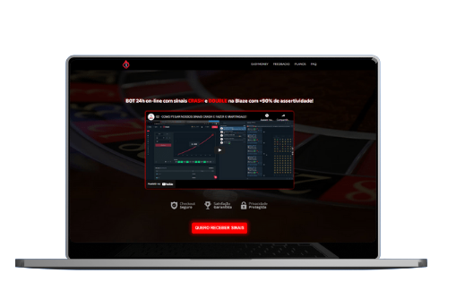
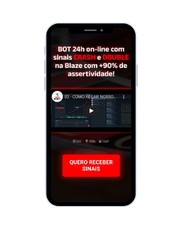

# Easymoney

Site para venda de grupo de sinais da Blaze desenvolvido para um cliente sem remuneração

## Preview 

   

   
   
   

<a href="https://vicctorneve.github.io/site-Easymoney/">clique aqui</a> para acessar o site

## Tecnologias e Ferramentas 

<ul>
   <li><a href="https://www.w3schools.com/html/">HTML</a>
   <li><a href="https://www.w3schools.com/css/">CSS</a>
   <li><a href="https://www.w3schools.com/js/">JS</a>
</ul>

## Status:

 🚀 Concluido mas sujeito a futuras atualizações 

